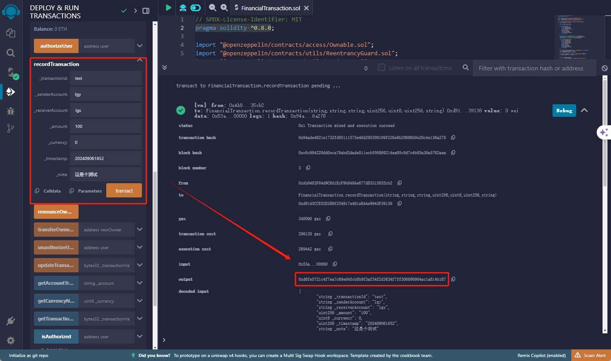

## 使用工具及语言

合约：solidity

在线IDE：[REMIX](https://remix.ethereum.org/#lang=en&optimize=false&runs=200&evmVersion=null&version=soljson-v0.8.26+commit.8a97fa7a.js)

本地开发工具：Truffle

本地以太坊环境： [Ganache](https://archive.trufflesuite.com/ganache/)

<br/>

### REMIX使用

Remix 是一个用于编写、编译、部署和调试以太坊智能合约的在线集成开发环境（IDE）。我们主要用到编写智能合约、合约编译、合约部署和调试。这些都是测试合约提供的功能，无需和后端代码交互。

#### 使用说明：

**合约编写**

**FinancialTransaction.sol**

```soy_template
// SPDX-License-Identifier: MIT
pragma solidity ^0.8.0;

import "@openzeppelin/contracts/access/Ownable.sol";
import "@openzeppelin/contracts/utils/ReentrancyGuard.sol";
import "@openzeppelin/contracts/utils/Strings.sol";

contract FinancialTransaction is Ownable, ReentrancyGuard {
    using Strings for uint256;
    
    enum Currency { USD, EUR }
    
    struct Transaction {
        string transactionId;
        string senderAccount;
        string receiverAccount;
        uint256 amount;
        Currency currency;
        uint256 timestamp;
        uint256 blockTimestamp;
        string note;
    }

    mapping(bytes32 => Transaction) private transactions;
    mapping(string => bytes32[]) private accountTransactions;
    mapping(address => bool) private authorizedUsers;

    event TransactionRecorded(
        bytes32 indexed hash,
        string transactionId,
        string senderAccount,
        string receiverAccount,
        uint256 amount,
        Currency currency,
        uint256 timestamp,
        uint256 blockTimestamp,
        string note
    );

    event TransactionNoteUpdated(bytes32 indexed hash, string note);
    event UserAuthorized(address user);
    event UserUnauthorized(address user);

    constructor() Ownable(msg.sender) {
        authorizedUsers[msg.sender] = true;
    }

    modifier onlyAuthorized() {
        require(authorizedUsers[msg.sender], "Not authorized");
        _;
    }

    function authorizeUser(address user) public onlyOwner {
        authorizedUsers[user] = true;
        emit UserAuthorized(user);
    }

    function unauthorizeUser(address user) public onlyOwner {
        authorizedUsers[user] = false;
        emit UserUnauthorized(user);
    }

    function recordTransaction(
        string memory _transactionId,
        string memory _senderAccount,
        string memory _receiverAccount,
        uint256 _amount,
        Currency _currency,
        uint256 _timestamp,
        string memory _note
    ) public onlyAuthorized nonReentrant returns (bytes32) {
        require(bytes(_transactionId).length > 0, "Transaction ID cannot be empty");
        require(bytes(_senderAccount).length > 0, "Sender account cannot be empty");
        require(bytes(_receiverAccount).length > 0, "Receiver account cannot be empty");
        require(_amount > 0, "Amount must be greater than 0");
        
        bytes32 transactionHash = keccak256(abi.encodePacked(_transactionId, _senderAccount, _receiverAccount, _amount, _currency, _timestamp, block.timestamp));
        
        require(transactions[transactionHash].timestamp == 0, "Transaction already exists");

        transactions[transactionHash] = Transaction({
            transactionId: _transactionId,
            senderAccount: _senderAccount,
            receiverAccount: _receiverAccount,
            amount: _amount,
            currency: _currency,
            timestamp: _timestamp,
            blockTimestamp: block.timestamp,
            note: _note
        });

        accountTransactions[_senderAccount].push(transactionHash);
        accountTransactions[_receiverAccount].push(transactionHash);

        emit TransactionRecorded(
            transactionHash,
            _transactionId,
            _senderAccount,
            _receiverAccount,
            _amount,
            _currency,
            _timestamp,
            block.timestamp,
            _note
        );

        return transactionHash;
    }

    function getTransactionByHash(bytes32 _transactionHash) public view onlyAuthorized returns (Transaction memory) {
        require(transactions[_transactionHash].timestamp != 0, "Transaction does not exist");
        return transactions[_transactionHash];
    }

    function getAccountTransactions(string memory _account) public view onlyAuthorized returns (bytes32[] memory) {
        return accountTransactions[_account];
    }

    function getCurrencyName(Currency _currency) public pure returns (string memory) {
        if (_currency == Currency.USD) {
            return "USD";
        } else if (_currency == Currency.EUR) {
            return "EUR";
        } else {
            revert("Invalid currency");
        }
    }

    function updateTransactionNote(bytes32 _transactionHash, string memory _note) public onlyAuthorized {
        require(transactions[_transactionHash].timestamp != 0, "Transaction does not exist");
        transactions[_transactionHash].note = _note;
        emit TransactionNoteUpdated(_transactionHash, _note);
    }

    function isAuthorized(address user) public view returns (bool) {
        return authorizedUsers[user];
    }
}
```


1、打开remix网站，点击上图的第一步

2、点击第二步创建新文件，文件名最好和合约名保持一致，也就是合约里面的FinancialTransaction，如图3、4

3、把合约复制到文件里，或者可以自己编写。这里需要注意的是pragma solidity ^0.8.0;这行，以太坊合约编译对于版本要求是强一致性，也就是一会编译合约选择的env版本至少大于等于编写的合约版本。

**合约编译**


1、如图所示选择左侧第三个图标

2、这里可以把Auto compile勾选上，后面修改代码选择第三个图标后会自动编译，不用点击图中第4步了

3、选择编译的版本，这里选的版本需要大于等于合约内容里面定义的pragma solidity ^0.8.0版本号，^这个意思是向上兼容

4、如果没有勾选Auto compile，手动点击compile合约。如果合约写的有问题，合约会报红，并有提示

<br/>

**合约部署**


1、选择第四个图标

2、选择部署的以太坊环境，这里直接使用Remix vm，我们只是做合约测试，不需要部署到正式环境

3、这里是地址列表，可以选择使用哪个以太坊账户部署合约，部署合约的账户默认有合约操作的权限，其他任何地址都没有操作合约的权限，后面会说怎么授权其他账户操作我们的智能合约

4、这一步是设置gas费，在这里直接选择Estimated Gas，让他自己预估

5、部署智能合约，右下角显示绿色的勾说明合约部署成功，可以点击debug查看具体信息。如下，包括交易hash，区块哈希，区块编号、合约地址等信息。


**调用合约**

合约部署完点击下面剪头，展开调用合约的各种方法，也就是合约里面定义的方法测试：


方法很多，具体说下授权方法和交易、查询

1、查询账户是否有访问权限，在把账户添加到授权队列，再查询是否有权限，在合约部署那块有个地址列表，我们选择第二个地址复制下


1、选择列表的第二个地址，然后点击第二步的复制，比如我的第二个地址是：0xAb8483F64d9C6d1EcF9b849Ae677dD3315835cb2

2、复制好了，在地址列表再切换到第一个地址，因为我们是用第一个地址部署的合约，其他地址没有调用合约的权限


3、选择isAuthorized，输入刚才复制的第二个地址，点击call，会看到返回false，说明该地址没有权限调用合约


4、授权该地址操作权限，如图1、2、3是授权地址权限，4、5、6、7查询刚才授权的地址是否有操作合约的权限


5、使用刚才授权的地址往以太坊的合约写数据，需要先把地址切换到刚才授权的地址，如图所示，填写相关信息，这里的货币单位我使用的是枚举类型，默认从0开始，后面可以再添加其他货币单位，点击transact后右边会显示交易信息，包括交易hash、块编号之类的，这里特别注意的是output，这里输出的是我们在合约中定义的交易id，后面就需要使用这个交易id去链上查询交易信息。



6、查询交易信息，如下图，输入刚才的output，查询会显示我们写入以太坊上的交易信息


<br/>

我们能用到的Remix功能就这些，其他的无需深入研究，Remix只是让我们测试合约编写是否正确，合约提供的方法是否能按预期调用和回显就可以了

<br/>

### Truffle使用

Truffle 是一个开发框架，专门用于以太坊智能合约的开发、测试和部署，主要包括项目结构管理、编译和部署合约、网络管理等，我们这个阶段可能用到的就是合约编写，合约编译和部署，这里的编译和部署就是部署到本地的以太坊环境，和remix不一样，remix部署是部署到虚拟的环境，当然remix也可以部署到其他环境。

**安装truffle**

本地需要部署node和npm，且版本不能过低，可以参考我本地的版本，我是在windows上测试的，其他环境也差不多


安装truffle

```sh
// 全局安装truffle
npm install -g truffle
// 创建并初始化项目
mkdir dapp
cd dapp
truffle init
```


使用IDE打开刚才的DAPP目录，我使用的是vs code:


1、在contracts目录下新建合约文件，把刚才的合约复制进去

2、在migrations目录下编写合约部署脚本，如图名字就叫2_deploy_contracts.js，这里对名字有一定要求。内容如下：

```jsx
const FinancialTransaction = artifacts.require("FinancialTransaction");

module.exports = function (deployer) {
  deployer.deploy(FinancialTransaction, { gas: 6721974 }); // 这里设置的gas需要小于Ganache的Gas上限，下面会说怎么看上限
}; 
```

3、如果合约报红，比如上图上的导入的依赖报错，说明本地没有这些依赖，需要使用npm安装依赖

```
// 在项目根目录下执行如下命令
npm install @openzeppelin/contracts
```


<br/>

到这里Truffle使用就先到这，因为后面涉及到合约部署，本地需要安装Ganache，然后使用Truffle命令完成合约的编译和部署

### Ganache安装

下载地址：[https://archive.trufflesuite.com/ganache/](https://archive.trufflesuite.com/ganache/)

安装后，直接打开Ganache，如下图选择Quickstart，使用新的得环境，如1，或者后面你保存的环境可以选择保存的环境，如图2


这里默认会给你是个账户，并且每个账户都有100ETH，一会我们部署的时候默认使用的是第一个账户地址


设置以太坊环境，包括端口号、编译器版本、网络ID等信息，点击设置，如图


如图所示，可以设置端口和网络ID，这里自动挖矿勾选上，不然每次发起交易都无法打包上链，需要手动挖矿产出块才可以


<br/>

这里设置Gas费的上线，后面的客户端代码调用合约设置的gas费不能超过这个阈值，同时hardfork选择London，这个和合约编译版本有关，经测试默认的无法编译


一切都设置好之后，点击右上角的save and restart，重启以太网络。回到首页的时候，最好点击保存，如下图，这样下次在启动Ganache的时候可以选择保存的workspace，不用再重头开始弄


<br/>

到这里，Ganache的设置就弄好了，下面配置Truffle，回到刚才的daap项目下面有个truffle-config.js配置文件

这里有几个地方需要修改下

1、network配置放开，修改如下：

```
 networks: {
    // Useful for testing. The `development` name is special - truffle uses it by default
    // if it's defined here and no other network is specified at the command line.
    // You should run a client (like ganache, geth, or parity) in a separate terminal
    // tab if you use this network and you must also set the `host`, `port` and `network_id`
    // options below to some value.
    //
    development: {
     host: "127.0.0.1",     // Localhost (default: none)
     port: 7545,            // Standard Ethereum port (default: none)
     network_id: "5777",       // Any network (default: none)
    },
```

2、compilers修改如下：

```
compilers: {
    solc: {
      version: "0.8.26",      // Fetch exact version from solc-bin (default: truffle's version),需要大于等于编写合约时设置的值
      // docker: true,        // Use "0.5.1" you've installed locally with docker (default: false)
      settings: {          // See the solidity docs for advice about optimization and evmVersion
      //  optimizer: {
      //    enabled: false,
      //    runs: 200
      //  },
       evmVersion: "london"      // 和Ganache选的hardfork保持一致
      }
    }
  },
```

全部配置如下：

```
/**
 * Use this file to configure your truffle project. It's seeded with some
 * common settings for different networks and features like migrations,
 * compilation, and testing. Uncomment the ones you need or modify
 * them to suit your project as necessary.
 *
 * More information about configuration can be found at:
 *
 * https://trufflesuite.com/docs/truffle/reference/configuration
 *
 * Hands-off deployment with Infura
 * --------------------------------
 *
 * Do you have a complex application that requires lots of transactions to deploy?
 * Use this approach to make deployment a breeze 🏖️:
 *
 * Infura deployment needs a wallet provider (like @truffle/hdwallet-provider)
 * to sign transactions before they're sent to a remote public node.
 * Infura accounts are available for free at 🔍: https://infura.io/register
 *
 * You'll need a mnemonic - the twelve word phrase the wallet uses to generate
 * public/private key pairs. You can store your secrets 🤐 in a .env file.
 * In your project root, run `$ npm install dotenv`.
 * Create .env (which should be .gitignored) and declare your MNEMONIC
 * and Infura PROJECT_ID variables inside.
 * For example, your .env file will have the following structure:
 *
 * MNEMONIC = <Your 12 phrase mnemonic>
 * PROJECT_ID = <Your Infura project id>
 *
 * Deployment with Truffle Dashboard (Recommended for best security practice)
 * --------------------------------------------------------------------------
 *
 * Are you concerned about security and minimizing rekt status 🤔?
 * Use this method for best security:
 *
 * Truffle Dashboard lets you review transactions in detail, and leverages
 * MetaMask for signing, so there's no need to copy-paste your mnemonic.
 * More details can be found at 🔎:
 *
 * https://trufflesuite.com/docs/truffle/getting-started/using-the-truffle-dashboard/
 */

// require('dotenv').config();
// const { MNEMONIC, PROJECT_ID } = process.env;

// const HDWalletProvider = require('@truffle/hdwallet-provider');

module.exports = {
  /**
   * Networks define how you connect to your ethereum client and let you set the
   * defaults web3 uses to send transactions. If you don't specify one truffle
   * will spin up a managed Ganache instance for you on port 9545 when you
   * run `develop` or `test`. You can ask a truffle command to use a specific
   * network from the command line, e.g
   *
   * $ truffle test --network <network-name>
   */

  networks: {
    // Useful for testing. The `development` name is special - truffle uses it by default
    // if it's defined here and no other network is specified at the command line.
    // You should run a client (like ganache, geth, or parity) in a separate terminal
    // tab if you use this network and you must also set the `host`, `port` and `network_id`
    // options below to some value.
    //
    development: {
     host: "127.0.0.1",     // Localhost (default: none)
     port: 7545,            // Standard Ethereum port (default: none)
     network_id: "5777",       // Any network (default: none)
    },
    //
    // An additional network, but with some advanced options…
    // advanced: {
    //   port: 8777,             // Custom port
    //   network_id: 1342,       // Custom network
    //   gas: 8500000,           // Gas sent with each transaction (default: ~6700000)
    //   gasPrice: 20000000000,  // 20 gwei (in wei) (default: 100 gwei)
    //   from: <address>,        // Account to send transactions from (default: accounts[0])
    //   websocket: true         // Enable EventEmitter interface for web3 (default: false)
    // },
    //
    // Useful for deploying to a public network.
    // Note: It's important to wrap the provider as a function to ensure truffle uses a new provider every time.
    // goerli: {
    //   provider: () => new HDWalletProvider(MNEMONIC, `https://goerli.infura.io/v3/${PROJECT_ID}`),
    //   network_id: 5,       // Goerli's id
    //   confirmations: 2,    // # of confirmations to wait between deployments. (default: 0)
    //   timeoutBlocks: 200,  // # of blocks before a deployment times out  (minimum/default: 50)
    //   skipDryRun: true     // Skip dry run before migrations? (default: false for public nets )
    // },
    //
    // Useful for private networks
    // private: {
    //   provider: () => new HDWalletProvider(MNEMONIC, `https://network.io`),
    //   network_id: 2111,   // This network is yours, in the cloud.
    //   production: true    // Treats this network as if it was a public net. (default: false)
    // }
  },

  // Set default mocha options here, use special reporters, etc.
  mocha: {
    // timeout: 100000
  },

  // Configure your compilers
  compilers: {
    solc: {
      version: "0.8.26",      // Fetch exact version from solc-bin (default: truffle's version)
      // docker: true,        // Use "0.5.1" you've installed locally with docker (default: false)
      settings: {          // See the solidity docs for advice about optimization and evmVersion
      //  optimizer: {
      //    enabled: false,
      //    runs: 200
      //  },
       evmVersion: "london"
      }
    }
  },

  // Truffle DB is currently disabled by default; to enable it, change enabled:
  // false to enabled: true. The default storage location can also be
  // overridden by specifying the adapter settings, as shown in the commented code below.
  //
  // NOTE: It is not possible to migrate your contracts to truffle DB and you should
  // make a backup of your artifacts to a safe location before enabling this feature.
  //
  // After you backed up your artifacts you can utilize db by running migrate as follows:
  // $ truffle migrate --reset --compile-all
  //
  // db: {
  //   enabled: false,
  //   host: "127.0.0.1",
  //   adapter: {
  //     name: "indexeddb",
  //     settings: {
  //       directory: ".db"
  //     }
  //   }
  // }
};

```

<br/>

**合约编译**

执行truffle compile，项目会多个build目录，下面都是合约的abi文件，这个文件在后端代码调用合约的时候需要用到。


除了上面说的通过truffle compile编译获取abi文件外，也可以通过Remix获取，因为有的后段代码不需要abi包含network信息，这个时候可以到remix获取abi文件。步骤如下：点击合约编译，在点击abi直接复制。


abi文件是个json文件，大致内容如下：

FinancialTransaction.json

```json
[
  {
    "inputs": [],
    "stateMutability": "nonpayable",
    "type": "constructor"
  },
  {
    "inputs": [
      {
        "internalType": "address",
        "name": "owner",
        "type": "address"
      }
    ],
    "name": "OwnableInvalidOwner",
    "type": "error"
  },
  {
    "inputs": [
      {
        "internalType": "address",
        "name": "account",
        "type": "address"
      }
    ],
    "name": "OwnableUnauthorizedAccount",
    "type": "error"
  },
  {
    "inputs": [],
    "name": "ReentrancyGuardReentrantCall",
    "type": "error"
  },
  {
    "anonymous": false,
    "inputs": [
      {
        "indexed": true,
        "internalType": "address",
        "name": "previousOwner",
        "type": "address"
      },
      {
        "indexed": true,
        "internalType": "address",
        "name": "newOwner",
        "type": "address"
      }
    ],
    "name": "OwnershipTransferred",
    "type": "event"
  },
  {
    "anonymous": false,
    "inputs": [
      {
        "indexed": true,
        "internalType": "bytes32",
        "name": "hash",
        "type": "bytes32"
      },
      {
        "indexed": false,
        "internalType": "string",
        "name": "note",
        "type": "string"
      }
    ],
    "name": "TransactionNoteUpdated",
    "type": "event"
  },
  {
    "anonymous": false,
    "inputs": [
      {
        "indexed": true,
        "internalType": "bytes32",
        "name": "hash",
        "type": "bytes32"
      },
      {
        "indexed": false,
        "internalType": "string",
        "name": "transactionId",
        "type": "string"
      },
      {
        "indexed": false,
        "internalType": "string",
        "name": "senderAccount",
        "type": "string"
      },
      {
        "indexed": false,
        "internalType": "string",
        "name": "receiverAccount",
        "type": "string"
      },
      {
        "indexed": false,
        "internalType": "uint256",
        "name": "amount",
        "type": "uint256"
      },
      {
        "indexed": false,
        "internalType": "enum FinancialTransaction.Currency",
        "name": "currency",
        "type": "uint8"
      },
      {
        "indexed": false,
        "internalType": "uint256",
        "name": "timestamp",
        "type": "uint256"
      },
      {
        "indexed": false,
        "internalType": "uint256",
        "name": "blockTimestamp",
        "type": "uint256"
      },
      {
        "indexed": false,
        "internalType": "string",
        "name": "note",
        "type": "string"
      }
    ],
    "name": "TransactionRecorded",
    "type": "event"
  },
  {
    "anonymous": false,
    "inputs": [
      {
        "indexed": false,
        "internalType": "address",
        "name": "user",
        "type": "address"
      }
    ],
    "name": "UserAuthorized",
    "type": "event"
  },
  {
    "anonymous": false,
    "inputs": [
      {
        "indexed": false,
        "internalType": "address",
        "name": "user",
        "type": "address"
      }
    ],
    "name": "UserUnauthorized",
    "type": "event"
  },
  {
    "inputs": [
      {
        "internalType": "address",
        "name": "user",
        "type": "address"
      }
    ],
    "name": "authorizeUser",
    "outputs": [],
    "stateMutability": "nonpayable",
    "type": "function"
  },
  {
    "inputs": [
      {
        "internalType": "string",
        "name": "_account",
        "type": "string"
      }
    ],
    "name": "getAccountTransactions",
    "outputs": [
      {
        "internalType": "bytes32[]",
        "name": "",
        "type": "bytes32[]"
      }
    ],
    "stateMutability": "view",
    "type": "function"
  },
  {
    "inputs": [
      {
        "internalType": "enum FinancialTransaction.Currency",
        "name": "_currency",
        "type": "uint8"
      }
    ],
    "name": "getCurrencyName",
    "outputs": [
      {
        "internalType": "string",
        "name": "",
        "type": "string"
      }
    ],
    "stateMutability": "pure",
    "type": "function"
  },
  {
    "inputs": [
      {
        "internalType": "bytes32",
        "name": "_transactionHash",
        "type": "bytes32"
      }
    ],
    "name": "getTransactionByHash",
    "outputs": [
      {
        "components": [
          {
            "internalType": "string",
            "name": "transactionId",
            "type": "string"
          },
          {
            "internalType": "string",
            "name": "senderAccount",
            "type": "string"
          },
          {
            "internalType": "string",
            "name": "receiverAccount",
            "type": "string"
          },
          {
            "internalType": "uint256",
            "name": "amount",
            "type": "uint256"
          },
          {
            "internalType": "enum FinancialTransaction.Currency",
            "name": "currency",
            "type": "uint8"
          },
          {
            "internalType": "uint256",
            "name": "timestamp",
            "type": "uint256"
          },
          {
            "internalType": "uint256",
            "name": "blockTimestamp",
            "type": "uint256"
          },
          {
            "internalType": "string",
            "name": "note",
            "type": "string"
          }
        ],
        "internalType": "struct FinancialTransaction.Transaction",
        "name": "",
        "type": "tuple"
      }
    ],
    "stateMutability": "view",
    "type": "function"
  },
  {
    "inputs": [
      {
        "internalType": "address",
        "name": "user",
        "type": "address"
      }
    ],
    "name": "isAuthorized",
    "outputs": [
      {
        "internalType": "bool",
        "name": "",
        "type": "bool"
      }
    ],
    "stateMutability": "view",
    "type": "function"
  },
  {
    "inputs": [],
    "name": "owner",
    "outputs": [
      {
        "internalType": "address",
        "name": "",
        "type": "address"
      }
    ],
    "stateMutability": "view",
    "type": "function"
  },
  {
    "inputs": [
      {
        "internalType": "string",
        "name": "_transactionId",
        "type": "string"
      },
      {
        "internalType": "string",
        "name": "_senderAccount",
        "type": "string"
      },
      {
        "internalType": "string",
        "name": "_receiverAccount",
        "type": "string"
      },
      {
        "internalType": "uint256",
        "name": "_amount",
        "type": "uint256"
      },
      {
        "internalType": "enum FinancialTransaction.Currency",
        "name": "_currency",
        "type": "uint8"
      },
      {
        "internalType": "uint256",
        "name": "_timestamp",
        "type": "uint256"
      },
      {
        "internalType": "string",
        "name": "_note",
        "type": "string"
      }
    ],
    "name": "recordTransaction",
    "outputs": [
      {
        "internalType": "bytes32",
        "name": "",
        "type": "bytes32"
      }
    ],
    "stateMutability": "nonpayable",
    "type": "function"
  },
  {
    "inputs": [],
    "name": "renounceOwnership",
    "outputs": [],
    "stateMutability": "nonpayable",
    "type": "function"
  },
  {
    "inputs": [
      {
        "internalType": "address",
        "name": "newOwner",
        "type": "address"
      }
    ],
    "name": "transferOwnership",
    "outputs": [],
    "stateMutability": "nonpayable",
    "type": "function"
  },
  {
    "inputs": [
      {
        "internalType": "address",
        "name": "user",
        "type": "address"
      }
    ],
    "name": "unauthorizeUser",
    "outputs": [],
    "stateMutability": "nonpayable",
    "type": "function"
  },
  {
    "inputs": [
      {
        "internalType": "bytes32",
        "name": "_transactionHash",
        "type": "bytes32"
      },
      {
        "internalType": "string",
        "name": "_note",
        "type": "string"
      }
    ],
    "name": "updateTransactionNote",
    "outputs": [],
    "stateMutability": "nonpayable",
    "type": "function"
  }
]
```

**合约部署**

执行命令 truffle deploy，如下图，会在Ganache部署我们的合约，其中有几个地方需要注意，在后面的后端代码操作合约的时候需要用到。

1、contract address：合约地址需要记住，代码开发的时候需要用到

2、account：部署合约的账户需要记住，代码开发的时候需要指定启动账户，这个时候需要指定部署合约的账户，其他账户没有操作合约的权限。


<br/>

打开Ganache，获取部署合约的账户的私钥，代码开发的时候需要用到，这个至少知道在哪里获取，如下图，点击第一个账户（刚才部署合约时的account账户）右边的小钥匙图标：


<br/>

同样我们部署合约或者发起交易都可以通过Ganache查看到，如下图，展示的是我们部署合约时发起的交易


合约部分大概就这么多，后面就是编写后端的代码，选择开发语言和数据库
